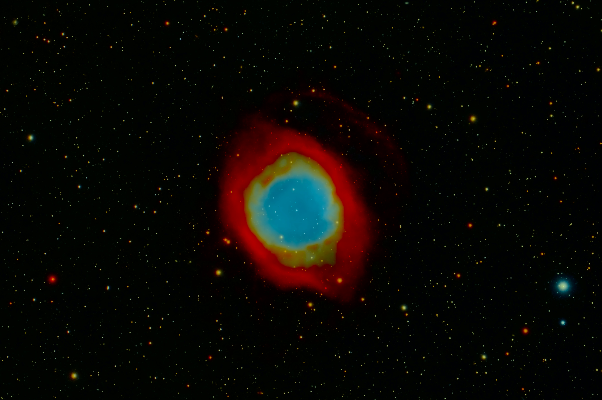

# Dementive leftwm theme

Simple [leftwm](https://github.com/leftwm/leftwm) theme with just enough to have a functional system.

# Features

1. Small red borders only on focused window.

2. No margins. I don't like wasted space.

3. Cool space background.

# Non-Features

1. Bar - All bars are just eyecandy, why use a bar when you can just use the terminal?

2. Compositor - More eyecandy that isn't needed.

# Dependencies

1. lxsession - This is the session manager im currently using, will replace with something else in the future probably. If you don't want it, just remove it from the up and down scripts.

2. feh - Set the desktop background

# Screenshots

