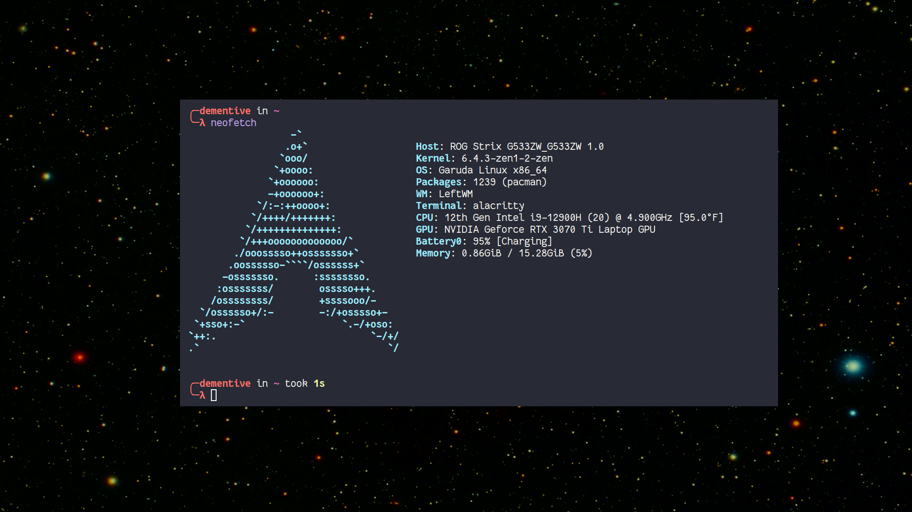

# Dementive leftwm theme

Minimal [leftwm](https://github.com/leftwm/leftwm) theme.

# Features

1. Small steel blue borders only on focused window.

2. No margins. I don't like wasted space.

3. Cool space background.

# Non-Features

1. Bar - I don't really need a bar.

# Optional Dependencies

There are no dependencies. I currently use these but they are optional and the theme will still work without them.

1. feh - Set the desktop background

2. xcompmgr - Compositor

3. dunst - Notifications

4. batsignal - A simple daemon to send notifications when battery is low. Not part of the repo but you'll probably want to set it up or something similar if you are using a laptop.

# Other themes and configs included

1. alacritty - Dracula based theme

2. config - My config.ron file for leftwm

3. firefox - My firefox css tweaks, see the README in the folder for more info.

4. fish - My fish config

5. gtk - The gtk 3/4 theme that I use.

6. kvantum - The kvantum theme that I use, matches the gtk theme well.

7. rofi - Minimal dark rofi theme

8. dunst - Dunst config that matches the theme

9. Scripts - These are some scripts I use to help manage my computer. You'll have to set these up to run from your config.ron or some other way, some changes may be needed to make icons show up properly if you do not have Papirus icons installed. The scripts included are:
	- brightness.sh - Sends dunst notifications when brightness changes
	- powermenu.sh - Logout/restart/shutdown menu using rofi
	- rofi-recorder - Record screen video/audio/video & audio, also screenshot a region or full screen. Uses rofi to show options.
	- volume.sh - Sends Dunst notifications when volume changes
	- wifimenu.sh - Connect to wifi, shows all available connections using nmcli, rofi and dunst.

# Screenshots

